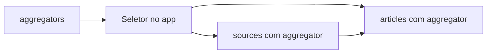

# daily-pulse-bff

BFF GraphQL em Ktor para o DailyPulse. Agrega fontes de notícia (NewsAPI e GNews), normaliza os dados e devolve só o contrato que o app usa nas telas.

Foi projetado para ser consumido pelo client Kotlin Multiplatform [DailyPulse-native-mpp](https://github.com/cristianopcortez/DailyPulse-native-mpp). O app não chama agregadores direto: as API keys ficam só neste BFF (`NEWS_API_KEY`, `GNEWS_API_KEY`).

## O que entra e o que não entra

O client tem três queries remotas: **Aggregators**, **Articles** e **Sources**. A tela **About** é informação local do device e **não** passa por este BFF.

Cache (SQLDelight) e pull-to-refresh ficam no app. Refresh é a mesma query GraphQL de novo (`forceFetch` no cliente). Este serviço não usa banco no v1.

## Multi-provider news

Feature que permite ao app escolher **qual agregador de notícias** usar (NewsAPI, GNews, …). O BFF expõe um catálogo, roteia as queries e mantém o mesmo contrato GraphQL para o KMP.

### Agregador vs jornal (source)

São níveis diferentes:

| Nível | O que é | Exemplo de `id` | Query |
| --- | --- | --- | --- |
| **Agregador** | Serviço/API de notícias | `newsapi`, `gnews` | `aggregators` |
| **Jornal (source)** | Veículo dentro do agregador | `bbc-news` (NewsAPI), hash (GNews) | `sources(aggregator: …)` |

Os ids de jornal **não são portáveis** entre agregadores. Ao trocar de `newsapi` para `gnews`, o app deve **limpar o jornal selecionado** e recarregar `sources` + `articles` com o novo `aggregator`.

### Fluxo esperado no app (KMP)

1. Buscar `aggregators` e preencher o seletor (lista vem do BFF, não hardcoded).
2. Usuário escolhe um agregador → persistir o `id` (default `newsapi`).
3. Carregar jornais: `sources(aggregator: $id)`.
4. Carregar notícias: `articles(aggregator: $id, source: $sourceOpcional)`.
5. Ao trocar agregador → limpar `source` salvo → repetir passos 3 e 4.



### Agregadores disponíveis e API keys

Cada agregador exige sua própria chave no BFF. Sem a key, o agregador **não aparece** em `aggregators` e não pode ser roteado.

| Agregador | `id` | Variável de ambiente | No catálogo quando |
| --- | --- | --- | --- |
| NewsAPI | `newsapi` | `NEWS_API_KEY` | Sempre registrado |
| GNews | `gnews` | `GNEWS_API_KEY` | Key definida no `.env` / secret |

Compatibilidade: queries sem `aggregator` continuam usando `newsapi` (comportamento do app legado).

### Limitação GNews + `source`

A API da GNews **não filtra por jornal** no endpoint de headlines. Quando o app passa `source`, o BFF busca até 100 artigos e **filtra pelo `source.id` no resultado**. Em planos com limite baixo de `max`, a lista pode voltar vazia com mais frequência que na NewsAPI.

## Contrato GraphQL

Campos da UI são non-null. Null dos agregadores vira fallback no BFF.

### Aggregators

Catálogo de agregadores **configurados** no BFF. NewsAPI entra sempre; GNews aparece quando `GNEWS_API_KEY` está definida.

Cada item: `id`, `name`.

- `id` — chave estável para o seletor do app (ex. `newsapi`, `gnews`)
- `name` — rótulo pronto para a UI (ex. `NewsAPI`, `GNews`)

```graphql
query Aggregators {
  aggregators {
    id
    name
  }
}
```

### Articles

Cada card: `title`, `desc`, `date`, `imageUrl`.

- `date` — ISO-8601 UTC (`2024-01-15T12:00:00Z`). O KMP formata "Today" / "Yesterday" / "N days ago".
- `desc` vazio/null → `"Click to find out more"`
- `imageUrl` vazio/inválido → imagem fallback CNBC

Argumentos opcionais:

- `aggregator: String` — id do agregador (ex. `newsapi`, `gnews`). Omitido → `newsapi`.
- `source: String` — id do jornal **dentro do agregador escolhido**. Omitido → headlines padrão (`country=us`, `category=business` para NewsAPI e GNews).

```graphql
query Articles($aggregator: String, $source: String) {
  articles(aggregator: $aggregator, source: $source) {
    title
    desc
    date
    imageUrl
  }
}
```

### Sources

Cada card: `id`, `name`, `desc`, `origin`.

- `id` — chave para filtrar articles naquele agregador (não aparece na UI)
- `origin` — texto pronto para a UI, `{country} - {language}` (ex. `us - en`)

Não expõe url nem category no v1 (GNews usa a URL do veículo como `desc` internamente no mapper).

Argumento opcional:

- `aggregator: String` — id do agregador (ex. `newsapi`, `gnews`). Omitido → `newsapi`.

```graphql
query Sources($aggregator: String) {
  sources(aggregator: $aggregator) {
    id
    name
    desc
    origin
  }
}
```

### Erros

Falhas da fonte voltam como GraphQL errors com mensagem segura, sem vazar API key.

| Situação | Mensagem (exemplo) |
| --- | --- |
| API key inválida / ausente no provider | `News source is not authorized` |
| Quota / rate limit | `News source quota exceeded` |
| Timeout | `News source timed out` |
| Provider indisponível | `News source is unavailable` |
| `aggregator` não configurado (ex. `gnews` sem `GNEWS_API_KEY`) | `News aggregator is not available: gnews` |
| Erro interno não mapeado | `Unable to load data` |

## Rodar local

Requisitos: JDK 21, Gradle Wrapper do repo, chaves em [newsapi.org](https://newsapi.org/) e/ou [gnews.io](https://gnews.io/).

```bash
cp .env.example .env
# preencha NEWS_API_KEY e, opcionalmente, GNEWS_API_KEY
./gradlew run
```

| Endpoint | Uso |
| --- | --- |
| `POST http://localhost:8080/graphql` | Queries do app |
| `http://localhost:8080/graphiql` | IDE GraphQL (só com `io.ktor.development=true`, ativo no `./gradlew run`) |
| `GET http://localhost:8080/health` | Health check |

```bash
./gradlew test
```

## Cloud Run

O servidor escuta `0.0.0.0` e a porta `PORT` (padrão 8080). Injete `NEWS_API_KEY` e `GNEWS_API_KEY` como secrets. GraphiQL não sobe no fat jar de produção.

Build da imagem: `Dockerfile` na raiz (`buildFatJar`).

## Arquitetura

- Schema GraphQL gerado a partir dos tipos Kotlin (`Aggregator`, `Article`, `Source`, `Query.aggregators`, `Query.articles`, `Query.sources`)
- `AggregatorCatalog` — catálogo de agregadores filtrado pelos providers configurados
- `AggregatorRouter` — roteia `articles`/`sources` para o `NewsProvider` do agregador escolhido
- `NewsProvider` — contrato estável para o app; adapters entram atrás dos mesmos tipos
- `NewsApiProvider` / `NewsApiClient` — REST NewsAPI, key no header `X-Api-Key`
- `GNewsProvider` / `GNewsClient` — REST GNews (`/api/v4`), key em `GNEWS_API_KEY`
